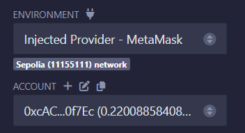

## Introduction

The `Telephone` contract demonstrates a common vulnerability in smart contracts related to the use of `tx.origin`. This challenge is designed to teach developers about the risks of relying on `tx.origin` for authentication.

## Target

The goal is to exploit the `Telephone` contract and change its `owner` to your own address by by passing the `tx.origin` check.

## Context

The `Telephone` contract uses `tx.origin` to verify the caller's authenticity in the `changeOwner` function. However, `tx.origin` is not reliable for authentication because it represents the original sender of the transaction, which can be manipulated through intermediary contracts.

## Security Vulnerability

The vulnerability lies in the use of `tx.origin` for access control in the `changeOwner` function. An attacker can deploy a malicious contract to call the `changeOwner` function on behalf of the original sender, bypassing the intended security check.

## Exploit Steps

To perform the attack and claim ownership of the `Telephone` contract, follow these steps:

1. **Check the Current Owner's Address**  
    Use the browser console after connecting to the blockchain environment to verify the current owner's address of the `Telephone` contract.
    ``` javascript 
    await contract.owner()
    ```

2. **Create the `Attack` Contract**  
    In Remix IDE, create the `Attack` contract. The `Attack` contract will have the necessary logic to exploit the vulnerability.
    ``` solidity
    contract Attack {
        Telephone telephone;

        constructor(address _telephone) {
            telephone = Telephone(_telephone);
        }

        function attack(address _newOwner) public {
            telephone.changeOwner(_newOwner);
        }
    }
    ```

4. **Switch to Injected Web3 Environment**  
    In Remix IDE, switch the environment to Injected Web3. This allows Remix to interact with your MetaMask wallet and the blockchain network.
    

5. **Deploy the `Attack` Contract**  
    In the "Deploy" field of Remix, select the `Attack` contract. When deploying, provide the address of the `Telephone` contract (`instance address`) as an argument to the constructor of the `Attack` contract.

6. **Call the `changeOwner` Function**  
    After deploying the `Attack` contract, locate the `changeOwner` function in the interaction panel. Enter your MetaMask address as the argument and call the function. This will send a transaction to execute the attack.

7. **Verify the Owner's Address Again**  
    Use the same command in the browser console as in Step 1 to check the owner's address of the `Telephone` contract. If the attack is successful, the owner's address will now be your MetaMask address.Complete!!

## Conclusion

This challenge highlights the dangers of using `tx.origin` for authentication in smart contracts. By exploiting this vulnerability, an attacker can bypass access control mechanisms and take unauthorized actions, such as changing the ownership of the contract. Developers should always use `msg.sender` for authentication and avoid relying on `tx.origin` to ensure secure and robust smart contract design.
